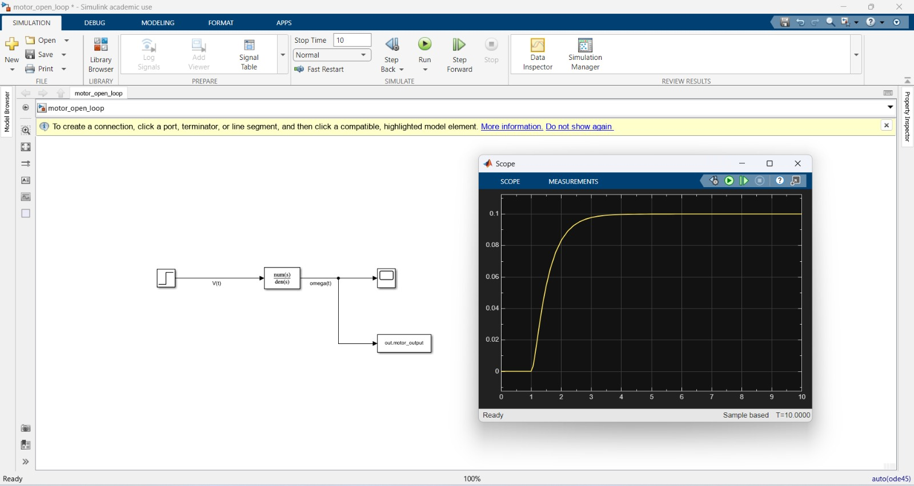

# Servo Motor Control — PID and LQR+Observer Design
**MATLAB/Simulink | Control Engineering Portfolio Project**  
*Purva Ghanate — M.Sc. Control Engineering, THM Friedberg*

---

## Motivation

During my internship at TOX Pressotechnik India, I commissioned 
Siemens S7-1515 servo-driven assembly lines and V90 servo axes 
for press machines. This project models the same servo motor 
physics in MATLAB/Simulink and systematically designs, compares, 
and validates three control strategies — from basic PID to 
modern LQR with state estimation.

---

## Project Structure
```
servo-motor-control-matlab/
|-- src/
|   |-- phase1_plant_model.m
|   |-- phase2a_manual_pid.m
|   |-- phase2b_pidtune.m
|   |-- phase3a_lqr.m
|   |-- phase3b_observer.m
|   |-- phase3c_lqr_observer_combined.m
|   └-- motor_open_loop.slx
└-- results/
```
---

## Phase 1 — Plant Modelling

Derived the transfer function and state-space representation 
of a PMDC motor from first principles (electrical + mechanical 
equations). Verified open-loop behaviour before designing 
any controller.

**Transfer Function:**

$$G(s) = \frac{K}{(Js+b)(Ls+R) + K^2} = 
\frac{0.01}{0.005s^2 + 0.06s + 0.1001}$$

**State-Space:**

$$A = \begin{bmatrix} -10 & 1 \\ -0.02 & -2 \end{bmatrix}, \quad
B = \begin{bmatrix} 0 \\ 2 \end{bmatrix}, \quad
C = \begin{bmatrix} 1 & 0 \end{bmatrix}$$

**Open-Loop Results:**

| Metric | Value |
|---|---|
| Rise time | 1.13 s |
| Settling time | 2.07 s |
| Steady-state error | 90% |
| Overshoot | 0% |
| Stability | Stable (poles: -9.99, -2.00) |





---

## Phase 2 — PID Controller

### 2A — Manual Tuning
Manually tuned Kp, Ki, Kd following P→I→D sequence. 
Achieved target specs on first structured attempt.

### 2B — Automatic Tuning with `pidtune`
Designed controllers at three crossover frequencies and 
compared against manual tune.

**Performance Comparison:**

| Controller | Rise (s) | Settling (s) | Overshoot |
|---|---|---|---|
| Open-Loop | 1.1351 | 2.0652 | 0.00% |
| PID Slow (wc=5) | 0.3345 | 1.2983 | 6.79% |
| PID Medium (wc=15) | 0.1090 | 0.5951 | 8.40% |
| PID Fast (wc=40) | 0.0406 | 0.2762 | 9.42% |
| **PID Manual** | **0.1209** | **0.4194** | **6.09%** |

Manual tuning achieved lower overshoot than all three 
auto-tuned variants while maintaining comparable rise time.


---

## Phase 3 — LQR + Luenberger Observer

### 3A — LQR State Feedback
Designed optimal state-feedback controller using Q/R 
cost matrices. Compared three weightings.

**Key result:** All LQR variants achieved 0% overshoot — 
impossible for PID at comparable rise times.

| Controller | Rise (s) | Settling (s) | Overshoot |
|---|---|---|---|
| LQR Conservative | 0.8082 | 1.4644 | 0.00% |
| LQR Balanced | 0.1912 | 0.3273 | 0.00% |
| LQR Aggressive | 0.0727 | 0.1260 | 0.00% |
| PID Manual | 0.1209 | 0.4194 | 6.09% |


### 3B — Luenberger Observer
Armature current cannot be directly measured on a real 
servo axis. Designed a Luenberger observer to estimate 
both states from velocity measurement only.

Observer poles placed 5x faster than controller poles 
following standard design rule.

| Observer | Poles | Converges at |
|---|---|---|
| Slow | [-40, -45] | 0.156 s |
| Medium | [-80, -85] | 0.081 s |
| Fast | [-150, -160] | 0.043 s |

Medium observer converges 4x faster than controller 
settling time — accurate estimates available throughout 
the transient.


### 3C — Combined LQR + Observer
Connected observer to LQR controller. Separation principle 
verified — combined system poles equal controller poles 
plus observer poles exactly.

**Final comparison:**

| Controller | Rise (s) | Settling (s) | Overshoot | SS Error |
|---|---|---|---|---|
| LQR + Observer | 0.1912 | 0.3273 | 0.00% | 0.00% |
| LQR Ideal | 0.1912 | 0.3273 | 0.00% | 0.00% |
| PID Manual | 0.1209 | 0.4194 | 6.09% | 0.00% |

Using estimated states instead of real states resulted in 
**zero performance loss** — separation principle confirmed.


---

## Tools
- MATLAB R2023b
- Simulink
- Control System Toolbox

---

## Author
**Purva Ghanate**  
M.Sc. Control, Computer & Communications Engineering  
Technische Hochschule Mittelhessen (THM), Friedberg  
[LinkedIn](https://linkedin.com/in/purva-ghanate-bb0a11257)
